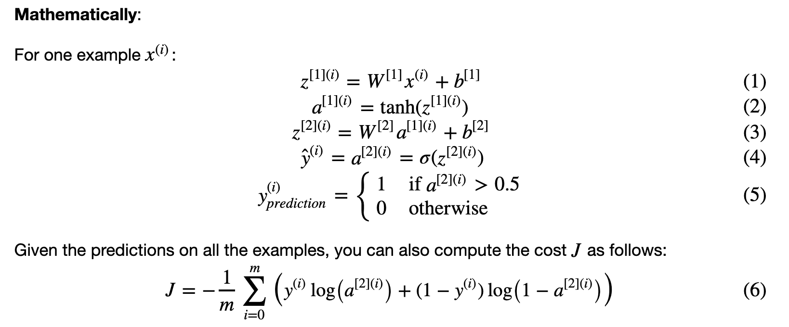
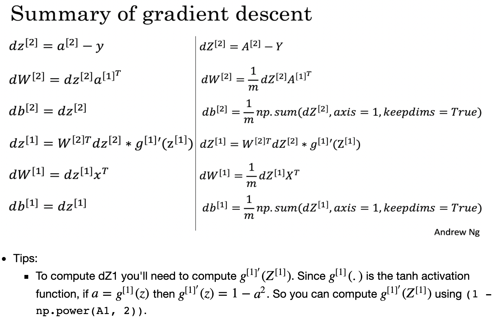

# Introduction
This will contain concepts and coding tools used for the second week of the tutorial. 

## Planar Data Classification with One Hidden Layer
To find the shape of a matrix, we can use the np.shape() function. In this case, when we were looking for the training set size, we set it to X.shape[1], which yields the number of columns of the numpy-array matrix with the features (or the training set size). There's a logistic regression function you can use in sklearn that can be run by doing the following: 

```python
clf = sklearn.linear_model.LogisticRegressionCV();
clf.fit(X.T, Y.T);
```
Then, you can plot this by doing the following: 

```python
# Plot the decision boundary for logistic regression
plot_decision_boundary(lambda x: clf.predict(x), X, Y)
plt.title("Logistic Regression")

# Print accuracy
LR_predictions = clf.predict(X.T)
print ('Accuracy of logistic regression: %d ' % float((np.dot(Y,LR_predictions) + np.dot(1-Y,1-LR_predictions))/float(Y.size)*100) +
       '% ' + "(percentage of correctly labelled datapoints)")
``` 

The first step to setting up the neural network structure is to define the layer sizes. In this case, we set the input layer to X.shape[0], where X is the input dataset of shape (input size, number of examples). We set the output layer to Y.shape[0] where Y is the labels of shape (output size, number of examples). 

The next step is initializing the model's parameters. This starts with intializing a weights matrix with ```Use: np.random.randn(a,b) * 0.01 to randomly initialize a matrix of shape (a,b).``` The parameters have the following dimensions:

* W1 -- weight matrix of shape (n_h, n_x)
* b1 -- bias vector of shape (n_h, 1)
* W2 -- weight matrix of shape (n_y, n_h)
* b2 -- bias vector of shape (n_y, 1)

Where the following holds true: 
* n_x -- size of the input layer
* n_h -- size of the hidden layer
* n_y -- size of the output layer

Now, we need to implement forward/backwards propagation. You need to retrieve each parameter and implement the propagation. The first step is getting the parameters from the previous step, which had added them to a dictionary in a function called init_parameters: 

```python
# Code Piece 1
parameters = {"W1": W1,"b1": b1,"W2": W2,"b2": b2}

# Code Piece 2
parameters["W1"] # How you'd call the W1 parameter, for example.  
```
Now, finding A2 via forward propagation by doing the following: computing the mathematic equations in the following with sigmoid, np.tanh(), and np.dot() functions. This is just the following:  



After that, we can compute the cost by using the cross-entropy equaiton and using np.multiply() plus np.sum() and then np.squeeze() to remove redundant dimensions (so a float will be reduced to a zero-dimension array). Part of this cost function looks like the following: 

```python
logprobs = np.multiply(np.log(A2),Y)
cost = - np.sum(logprobs) 
``` 
Now, we need to implement backwards propagation by doing the following: 



Then, we need to implement the gradient descent update rule by noting that theta = theta - alpha*dj/dtheta where theta is the parameter you're updating! After doing that, you can define a neural net model that initializes parameters, performs forward propagation, computes cost, does backwards propagation, and then updates parameters for every number of iterations. You can build a predict function that does forward propagation and then outputs the accuracy. 

